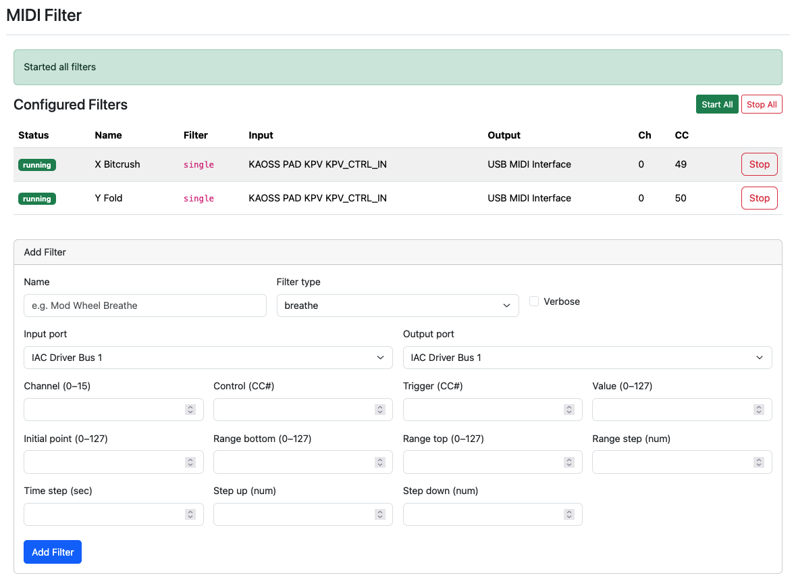

# Mojo-MIDIFilter
Apply MIDI Filters to Open Ports



## Installation

Clone the repo and change to that directory:
```shell
git clone https://github.com/ology/Mojo-MIDIFilter.git
cd Mojo-MIDIFilter/
```

Install the Perl dependencies:
```shell
cpanm --verbose --installdeps .
```

Run the app:
```shell
morbo midi-filter.pl --verbose --listen http://127.0.0.1:3333
# or
hypnotoad midi-filter.pl
```

Browse to http://127.0.0.1:3333/ or wherever hypnotoad is configured for.

Voila! :D
